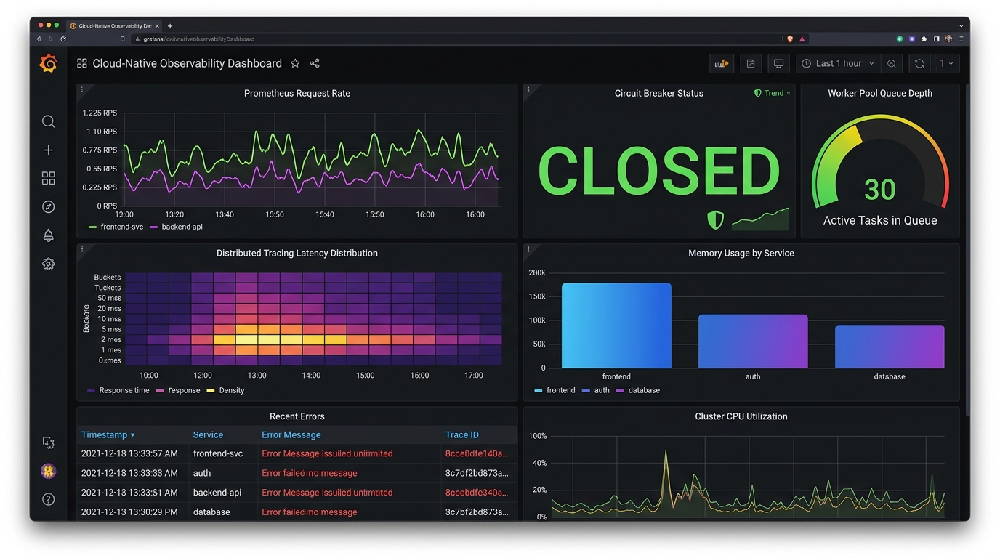

# go-libs · v0.1.0

Production Go microservices frequently reimplement identical operational plumbing—circuit breakers, rate limiters, singleflight caching, worker pools, structured error hierarchies, and graceful shutdown—leading to inconsistent behavior and dependency sprawl across services. `go-libs` provides a unified suite of 31 packages and Gin middleware with verified statement coverage under a single module BOM. Each package is independently importable with zero business domain logic, delivering hardened operational primitives without framework lock-in.

[](https://pkg.go.dev/github.com/umesh0492/go-libs)
[](https://golangci-lint.run/)
[](https://github.com/umesh0492/go-libs/actions/workflows/ci.yml)
[](#-verified-statement-coverage-status)
[](https://securityscorecards.dev/viewer/?repo=github.com/umesh0492/go-libs)
[](LICENSE)

Shared, zero-business-logic Go libraries and middleware for cloud-native microservices.

> 📖 **Engineering Documentation & Architecture Blueprint**  
> Complete subsystem guides, module selection flowcharts, architectural rationales, and execution topologies:  
> - 🏛️ **[System Architecture & Blueprint](docs/ARCHITECTURE.md)** (Topology, Layering Boundaries, Middleware Order)  
> - 📜 **[Changelog & Release Record](CHANGELOG.md)** (v0.1.0 release ledger, API errata, and evolution)  
> - 🏷️ **[Versioning & Stability Matrix](docs/VERSIONING.md)** (Semantic versioning contracts and package tiers)  
> - ⚡ **[Performance Benchmarks](BENCHMARKS.md)**  
> - 📝 **[Decisions & Architecture Records](docs/adr/0001-domain-decoupling-and-audit-sink.md)**  

Each package is independently importable, fully tested with verified statement coverage across critical paths, and has **no dependency on any external business domain layer**. All packages live under one `go.mod` to guarantee version lock-step across every service that imports them.

### Multi-Package "BOM" Architecture

This repository uses a **Single Module Monorepo** pattern. There is only *one* `go.mod` file at the root of `go-libs`. 

**Why is this the best "BOM" (Bill of Materials) way?**
By having a single `github.com/umesh0492/go-libs@v0.1.0` import, you guarantee that all internal packages (`db`, `recovery`, `ratelimit`, `cache`, `workerpool`, `metrics`, `retry`, `telemetry`) are perfectly synced to the same tested release threshold across all your microservices. It prevents version drifting between interconnected middleware packages natively.

### Minimal-Footprint Imports

Despite living in a single module, each package resolves independently in Go's dependency graph. Importing lightweight leaf packages (such as `shutdown`, `retry`, `sliceutil`, `env`, or `apperror`) pulls **zero heavy third-party frameworks** (`gin`, `pgx`, or `opentelemetry`) into your `go.sum` or compiled binary.

You can verify this claim in 30 seconds from a clean scratch directory:

```bash
# 1. Create an isolated scratch module
mkdir -p /tmp/verify-leaf && cd /tmp/verify-leaf
go mod init verify-leaf

# 2. Write a minimal app importing only shutdown
cat << 'EOF' > main.go
package main

import (
	"fmt"
	"time"
	"github.com/umesh0492/go-libs/shutdown"
)

func main() {
	sm := shutdown.New(5 * time.Second)
	fmt.Println("Graceful shutdown manager ready:", sm != nil)
}
EOF

# 3. Resolve dependencies
go get github.com/umesh0492/go-libs@v0.1.0
go mod tidy

# 4. Prove no heavy frameworks exist in go.sum (exits 0 with zero output if clean)
grep -E 'gin-gonic|jackc/pgx|opentelemetry' go.sum || echo "VERIFIED: Zero heavy dependencies in go.sum"
```

> 🛡️ **Continuous CI Regression Guard**: Every pull request runs [`scripts/check_leaf_imports.sh`](scripts/check_leaf_imports.sh) in an isolated sandbox across 13 leaf packages to ensure no heavy framework can ever quietly leak into lightweight primitives.

---

## Installation

```bash
go get github.com/umesh0492/go-libs@v0.1.0
```

Requirements:
- Go `1.25.0` or higher

---

## Quick Start: Headline Packages

### 1. `retry` — Context-Aware Backoff & Jitter
Declarative execution with exponential jitter backoff, deadline awareness, and non-retryable error short-circuiting:
```go
import (
	"context"
	"time"

	"github.com/umesh0492/go-libs/retry"
)

cfg := retry.Config{
	Attempts:    3,
	InitialWait: 100 * time.Millisecond,
	MaxWait:     2 * time.Second,
	Strategy:    retry.ExponentialJitter,
}

err := retry.Do(ctx, cfg, func(ctx context.Context) error {
	return fetchRemoteData(ctx)
})
```

### 2. `circuitbreaker` — Fail-Fast 3-State Machine
Protects downstream dependencies using consecutive failures or failure ratio thresholds with immediate short-circuiting when open:
```go
import (
	"context"
	"time"

	"github.com/umesh0492/go-libs/circuitbreaker"
)

// Trips open after 3 consecutive failures; re-tests after 500ms
cb := circuitbreaker.NewConsecutiveBreaker(3, 500*time.Millisecond)

err := cb.Execute(ctx, func() error {
	return queryExternalService(ctx)
})
```

### 3. `ratelimit` — Token Bucket & Sliding Window
In-memory multi-tenant rate limiting and standard HTTP middleware with RFC-compliant `RateLimit-*` headers:
```go
import (
	"net/http"
	"time"

	"github.com/umesh0492/go-libs/ratelimit"
)

// Standalone in-memory rate limiter (100 req / minute)
limiter := ratelimit.NewTokenBucket(100, time.Minute)
if !limiter.Allow("tenant-client-ip") {
	// 429 Too Many Requests
}

// Or as standard HTTP middleware with RFC headers
handler := ratelimit.New(100, time.Minute)(nextHandler)
```

### 4. `cache` — Singleflight Stampede-Protected In-Memory Cache
Generic typed cache with singleflight request coalescing (`GetOrFetch`), TTL expiration, and pluggable eviction policies:
```go
import (
	"context"
	"time"

	"github.com/umesh0492/go-libs/cache"
)

c := cache.NewTypedCache[UserProfile](
	cache.WithCapacity[UserProfile](10_000),
	cache.WithEvictionPolicy[UserProfile](cache.EvictionSampledLRU),
)

// Singleflight prevents concurrent thundering herd queries for identical keys
profile, err := c.GetOrFetch(ctx, "user:123", 5*time.Minute, func(ctx context.Context) (UserProfile, error) {
	return loadUserFromDB(ctx, 123)
})
```

### 5. `workerpool` — Bounded Panic-Safe Concurrency
Fixed-size worker pools with task buffering, metric collection, and graceful drain-and-stop:
```go
import (
	"github.com/umesh0492/go-libs/workerpool"
)

// 4 concurrent workers, queue buffer of 100 tasks
wp := workerpool.New(4, 100)
defer wp.StopWait() // drains remaining queue before shutting down

_ = wp.Submit(func() {
	processJob(job)
})
```

### 6. `env` — Zero-Dependency Typed Environment Parsing
Safe environment parsing with sensible fallbacks and zero external reflection dependencies:
```go
import (
	"time"

	"github.com/umesh0492/go-libs/env"
)

port := env.Int("PORT", 8080)
dbTimeout := env.Duration("DB_TIMEOUT", 5*time.Second)
isProduction := env.Bool("PRODUCTION", true)
appName := env.String("APP_NAME", "order-service")
```

### 7. `apperror` — Structured Domain Error Hierarchy
Canonical typed error codes mapping cleanly to HTTP status codes with `errors.Is` support:
```go
import (
	"github.com/umesh0492/go-libs/apperror"
)

func FindUser(id string) (*User, error) {
	return nil, apperror.NotFound("user not found")
}

// Check error codes with standard errors.Is semantics
if apperror.Is(err, apperror.CodeNotFound) {
	status := err.(*apperror.Error).GetStatus() // 404
}
```

---

## Why go-libs vs. Alternatives?

Go developers frequently face a choice between assembling dozens of single-purpose third-party packages (each with differing API idioms, logging adapters, and maintenance cadences) or maintaining bespoke operational code in every repository. `go-libs` provides a deliberate middle ground: a unified BOM of standard operational primitives with zero business domain logic and zero framework lock-in.

| Capability | Common Alternative | Why Choose `go-libs`? | Trade-offs & When to Use Alternative |
|---|---|---|---|
| **Circuit Breaker** | `sony/gobreaker` | Native support for both consecutive-failure and failure-ratio algorithms, built-in metrics adapters, context-aware execution, and zero external dependencies. | `sony/gobreaker` is a mature industry standard; choose it if you need its specific cyclic generation model or custom count windows without adopting our metrics interface. |
| **Retry & Backoff** | `cenkalti/backoff` | Clean, declarative `retry.Do` and `retry.DoWithResult[T]` APIs with native exponential jitter, deadline cancellation, and automatic classified non-retryable error short-circuiting. | `cenkalti/backoff` offers dedicated ticker implementations and complex custom retry state machines; choose it if you need streaming retry tickers rather than function invocation. |
| **Rate Limiter** | `uber-go/ratelimit` | Multi-tenant keyed limiters (`TokenBucket`, `SlidingWindow`), CIDR proxy header resolution, and RFC-compliant `RateLimit-*` HTTP headers. | `uber-go/ratelimit` uses an atomic leaky bucket designed for ultra-high-throughput request pacing; choose it if you need microsecond-level smooth pacing for outbound traffic rather than inbound multi-tenant HTTP throttling. |
| **In-Memory Cache** | `dgraph-io/ristretto` / `allegro/bigcache` | Generic type safety (`[T]`), built-in singleflight request coalescing (`GetOrFetch` prevents thundering herds), pluggable eviction policies (SampledLRU, LRU, LFU, FIFO), and zero CGo/unsafe code. | `ristretto` and `bigcache` are optimized for high concurrency with millions of entries using off-heap buffers or complex TinyLFU pipelines; choose them if you are caching tens of gigabytes of data where GC pause reduction is paramount. |

---

## Reference Blueprint Microservice & Cloud-DevOps Suite

A complete, runnable reference implementation composing `ginmw`, `cache`, `workerpool`, `health`, `logger`, `metrics`, `circuitbreaker`, `retry`, and `shutdown` into a unified production service is available in [**`examples/microservice/`**](examples/microservice/):

```bash
# Run the reference microservice
go run ./examples/microservice

# Run its end-to-end integration tests
go test -v -race ./examples/microservice

# Build the distroless minimal Docker container (<18MB, non-root UID 65532)
docker build -t microservice:1.0.0 -f examples/microservice/Dockerfile .

# Deploy via production Kubernetes Helm Chart (with HPA, PDB, ServiceMonitor)
helm upgrade --install microservice ./deploy/helm/microservice
```

---

## Package Inventory

### 1. Framework-Agnostic Core Infrastructure & Resilience

| Package | Import suffix | Key exports & Description |
|---|---|---|
| `metrics` | `/metrics` | `Counter`, `Gauge`, `Histogram` interfaces and zero-allocation no-ops for pluggable Prometheus/OpenTelemetry instrumentation |
| `retry` | `/retry` | `Do`, `DoWithResult[T]`, `Config` with `Constant`, `Linear`, `Exponential`, `ExponentialJitter` backoff strategies |
| `circuitbreaker` | `/circuitbreaker` | `NewConsecutiveBreaker(maxFailures, timeout, opts...)`, `NewRatioBreaker(...)` — outbound 3-state machine |
| `clock` | `/clock` | `Clock`, `RealClock`, `FakeClock` — deterministic mockable time abstraction for sleep-free tests |
| `workerpool` | `/workerpool` | `New(workers, queueSize, opts...)`, `Submit(task) error`, `SubmitContext(ctx, task) error`, `WithMetrics`, `WithPanicHandler` |
| `cache` | `/cache` | `NewTypedCache[T](opts...)`, `GetOrFetch`, `WithMetrics`, `WithEvictionInterval` — generic singleflight stampede-protected cache |
| `shutdown` | `/shutdown` | `New(timeout)`, `.Register(name, fn)`, `.Execute(ctx)`, `.Wait()` — concurrent graceful teardown manager |

---

### 2. Functional Generics, Errors & Foundation

| Package | Import suffix | Key exports & Description |
|---|---|---|
| `sliceutil` | `/sliceutil` | `Reduce`, `GroupBy`, `Chunk`, `Unique`, `Flatten`, `First` — generic algorithmic slice primitives |
| `maputil` | `/maputil` | `Merge`, `Filter` — generic type-safe map operations |
| `apperror` | `/apperror` | `CodeNotFound`, `CodeUnauthorized`, `CodeConflict`, `New`, `Wrap`, `Is` — canonical structured domain errors |
| `env` | `/env` | `String`, `Int`, `Bool`, `Duration`, `MustString`, `MustInt` — zero-dependency typed OS environment parsers |
| `logger` | `/logger` | `Default()`, `FromContext(ctx)`, `WithContext(ctx, l)`, `WithField`, `WithFields` — context-aware structured `slog` |
| `stringutil` | `/stringutil` | `OrDefault`, `MaskEmail`, `MaskPhone`, `TrimAndLower`, `Truncate`, `RandomStringFromReader` — safe string operations |
| `timeutil` | `/timeutil` | `NowIn(loc)`, `FormatIn`, `StartOfDay`, `EndOfDay`, `AddBusinessDays` — parametric time helpers |
| `cryptoutil` | `/cryptoutil` | `GenerateTempPassword(n)`, `HashPassword(pwd)`, `ComparePassword(hash, pwd)` — secure credential helpers backed by `crypto/rand` (CSPRNG) and `golang.org/x/crypto/bcrypt` (OWASP cost factor 12) |

---

### 3. Framework-Agnostic HTTP Middleware & Transport

Compatible with standard library `http.Handler`, Chi, Echo, or any Go HTTP framework.

| Package | Import suffix | Key exports & Description |
|---|---|---|
| `httpclient` | `/httpclient` | `New(opts...)`, `NewRoundTripper`, `WithRetry`, `WithCircuitBreaker`, `WithRateLimiter` — resilient composed HTTP transport client |
| `ratelimit` | `/ratelimit` | `New(cap, window, opts...)`, `NewGlobal()`, `NewAuth()`, RFC `RateLimit-*` headers, `WithMetrics` |
| `securityheaders` | `/securityheaders` | `New(opts...)` — OWASP defensive security headers (CSP, HSTS, X-Frame) |
| `bodylimit` | `/bodylimit` | `New(maxBytes)`, `MB(n)`, `KB(n)`, `String(bytes)` — HTTP request body size limiter preventing payload inflation attacks |
| `requestid` | `/requestid` | `Middleware`, `FromContext(ctx)`, `Header` constant — W3C correlation ID propagation |
| `recovery` | `/recovery` | `Middleware(opts...)` — JSON panic recovery with structured `slog` output |
| `httputil` | `/httputil` | `OK`, `Created`, `NoContent`, `Error`, `ErrorFromDomain`, `ValidationError` — standardized responses |
| `pagination` | `/pagination` | `Parse(r)`, `NewResponse`, `NewTypedResponse[T]` — generic query parsing and response formatting |
| `health` | `/health` | `New(checks...)`, `LivenessHandler`, `ReadinessHandler`, `.Handler` — parallel HTTP probe service |
| `idempotency` | `/idempotency` | `NewMemoryStore()`, `Store` interface — two-phase request deduplication and response caching |
| `validation` | `/validation` | `FormatErrors(err)` — human-readable validator/v10 struct validation error formatting |

---

### 4. Data Access & Security Primitives
 
| Package | Import suffix | Key exports & Description |
|---|---|---|
| `db` | `/db` | `Connect(ctx, url, opts)`, `GetQuerier(ctx, pool)`, `DBTX` interface — pgx connection pool wrapper |
| `rbac` | `/rbac` | `NewEngine()`, `Engine.Match(pattern, action)` — role-based access control engine |
| `rbaccontext` | `/rbaccontext` | `WithPermissions(ctx, perms)`, `Can(ctx, perm)`, `CanAny(ctx, perms...)` — permission helpers |
| `telemetry` | `/telemetry` | `NewTracerProvider(opts...)`, `InitProvider(tp)`, `StartSpan(ctx, tracer, span)` — OpenTelemetry distributed tracing |

> [!NOTE]
> **Domain & Application Accelerators**:
> High-level business and application-layer capabilities (Multi-channel Notifications, PDF Generation with GST Invoice Templates, Transactional Outbox Engine with PostgreSQL DDL, Localized Indian Fintech Helpers, Partitioned Audit Logging, and Streaming Data Export) are maintained in the companion accelerator repository: [**`github.com/umesh0492/go-app-kit`**](https://github.com/umesh0492/go-app-kit).

---

### 5. Gin-Specific Middleware Pipeline (`ginmw`)

All Gin-specific middleware wrappers live in `ginmw` for uniform imports.

| Package | Import suffix | Key exports & Description |
|---|---|---|
| `ginmw` | `/ginmw` | `AuthMiddleware`, `GenerateToken`, `GetClaims`, `RateLimit`, `Recovery`, `RequestID`, `SecurityHeaders`, `Idempotency`, `Logger` — unified Gin web framework middleware suite |

| Function | Purpose |
|---|---|
| `ginmw.AuthMiddleware()` | Validates Bearer JWT; injects `*Claims` into context |
| `ginmw.GenerateToken(claims, timeInMins)` | Mints signed HS256 access token with custom TTL (`claims *Claims, timeInMins int64`) |
| `ginmw.GetClaims(c)` | Extracts `*Claims` from gin context |
| `ginmw.RBAC(provider)` | Loads live DB permissions per request into context |
| `ginmw.RequirePermission(perm)` | Aborts 403 if context lacks exact permission |
| `ginmw.RequireAnyPermission(perms...)` | Aborts 403 if context lacks all listed permissions |
| `ginmw.AdminOnly()` | Restricts route to platform-admin roles |
| `ginmw.CORS(allowedOrigins)` | CORS with wildcard-suffix support (`*.example.com`) |
| `ginmw.GlobalRateLimit()` | IP token-bucket: 200 req/min (flood protection) |
| `ginmw.AuthRateLimit()` | IP token-bucket: 10 req/min (brute-force protection) |
| `ginmw.LimitBodyDefault()` | 2 MB max body for all API routes |
| `ginmw.LimitBodyAuth()` | 4 KB max body for auth endpoints |
| `ginmw.SecurityHeaders(name)` | OWASP defensive headers (CSP, HSTS, X-Frame) |
| `ginmw.RequestID()` | Injects/propagates `X-Request-ID` |
| `ginmw.Logger()` | Structured access log (method, path, status, latency) |
| `ginmw.Telemetry(service)` | OpenTelemetry W3C trace context extraction and span lifecycle |
| `ginmw.Idempotency(store)` | Two-phase HTTP request deduplication and response caching |

---

## 📊 Verified Statement Coverage Status

Coverage across all 31 packages in `go-libs` is measured using Go's official statement-level coverage tool (`go test -short -coverprofile=coverage.out ./...`):

> **Overall Repository Statement Coverage: 95.5%** (Zero data races across `-race`)
> **Core Middleware Gate (`ginmw`): 100.0%**
> **Quality Standard: Strict per-package floor >= 85.0% enforced by `./scripts/check_coverage.sh`**

| Package | Purpose | Statement Coverage |
|---|---|---|
| `apperror` | Canonical structured application error codes and helpers | **100.0%** |
| `bodylimit` | Gin middleware to cap HTTP request body sizes | **100.0%** |
| `cache` | Generic singleflight stampede-protected multi-policy cache (SampledLRU, LRU, LFU, FIFO, TTL) | **87.5%** |
| `circuitbreaker` | Outbound resilience 3-state machine (Consecutive & Failure Ratio algorithms) | **92.2%** |
| `clock` | Deterministic mockable time abstraction with RealClock and advanceable FakeClock | **93.9%** |
| `cryptoutil` | Secure password hashing (`golang.org/x/crypto/bcrypt`) and CSPRNG password generation (`crypto/rand`) | **100.0%** |
| `db` | Database Pool & Querier | **100.0%** |
| `env` | Zero-dependency typed environment variable parsers | **100.0%** |
| `ginmw` | Unified Gin HTTP middleware chain & helper | **100.0%** |
| `health` | Parallel dependency health check and Kubernetes probe handler | **100.0%** |
| `httpclient` | Resilient composed HTTP client (RateLimit -> CircuitBreaker -> Retry -> Timeout -> Transport) | **92.0%** |
| `httputil` | Standardized JSON response and error handlers | **100.0%** |
| `idempotency` | Two-phase HTTP request deduplication | **98.8%** |
| `logger` | Request-context aware structured logging with `slog`, sampling, and sensitive data redaction | **95.0%** |
| `maputil` | Generic type-safe map operations | **100.0%** |
| `metrics` | Framework-agnostic Counter, Gauge, Histogram interfaces | *N/A (Pure Interfaces)* |
| `pagination` | Offset-based request query parser and generic response | **100.0%** |
| `ratelimit` | IP rate limiters (TokenBucket, SlidingWindow) with CIDR proxy parsing | **100.0%** |
| `rbac` | Role-Based Access Control logic engine | **100.0%** |
| `rbaccontext` | Context-based permission lookup helpers | **100.0%** |
| `recovery` | Panic-to-JSON-500 middleware with structured logging | **100.0%** |
| `requestid` | Correlation ID generator and context propagator | **100.0%** |
| `retry` | Context-aware backoff and retry execution algorithms | **90.7%** |
| `securityheaders` | OWASP secure header injector middleware | **100.0%** |
| `shutdown` | Graceful concurrent teardown manager | **100.0%** |
| `sliceutil` | Algorithmic slice operations (Reduce, GroupBy, Chunk, Unique, Flatten, First) | **100.0%** |
| `stringutil` | Sensitive info masking and text helpers | **100.0%** |
| `telemetry` | OpenTelemetry distributed tracing wrapper | **100.0%** |
| `timeutil` | Parametric time arithmetic, RFC parsing, business days, and timezone utilities | **100.0%** |
| `validation` | Declarative validation error formatter | **100.0%** |
| `workerpool` | Bounded panic-safe concurrent worker pool with metrics & options | **92.1%** |
| **Total Statement Coverage** | **Cumulative across all packages** | **95.5%** |

> *Note: The standalone reference microservice (`examples/microservice`) achieves 87.4% integration statement coverage.*

---

## 🔭 Local Observability Sandbox (Prometheus + Grafana)

Boot the entire microservice along with a live Prometheus scraper and pre-provisioned Grafana Golden Signals dashboard in one command:

```bash
docker compose -f deploy/docker-compose.observability.yml up --build
```
- **Microservice API**: `http://localhost:8080` (`/metrics`, `/health`, `/api/v1/items`)
- **Prometheus Scraper**: `http://localhost:9090`
- **Grafana Dashboard**: `http://localhost:3000` (auto-authenticated, view pre-configured **Microservice Golden Signals & Resilience** dashboard)



> **Looking for full enterprise cluster-wide observability?**  
> Check out our companion platform repository: [**cloud-native-observability**](https://github.com/umesh0492/cloud-native-observability) featuring the complete LGTM stack (Loki, Grafana, Tempo, Prometheus) + OpenTelemetry with ArgoCD GitOps and Google SRE SLO alerting!

---

## Contributing & Development

```bash
# Run all core quality checks (linting, tests with -race, coverage gates)
make all

# Run linters across all packages
make lint

# Run all unit tests with data race detection (fast, scale tests excluded)
make test-race

# Run comprehensive statement coverage gates (global >=90%, pkg >=85%, ginmw 100%)
make coverage

# Run benchmarks and regression analysis against baseline
make bench

# Run fuzz testing suite (10s per target)
make fuzz

# Run dedicated scale and 1000-connection load tests
make test-scale

# Run 10-iteration stress testing under race detector
make stress
```

Please see [CONTRIBUTING.md](CONTRIBUTING.md) for contribution guidelines, [SECURITY.md](SECURITY.md) for security reporting, and [CODE_OF_CONDUCT.md](CODE_OF_CONDUCT.md) for our code of conduct.

### 📦 Repository Provenance & Release Record

`go-libs` was published as a unified open-source baseline at `v0.1.0`. For the complete version-by-version delivery record and historical commit errata, see **[CHANGELOG.md](CHANGELOG.md)**. Full semantic versioning contracts and package stability tiers are detailed in **[docs/VERSIONING.md](docs/VERSIONING.md)**.

---

## License

MIT License. Copyright (c) 2026 umesh0492.
