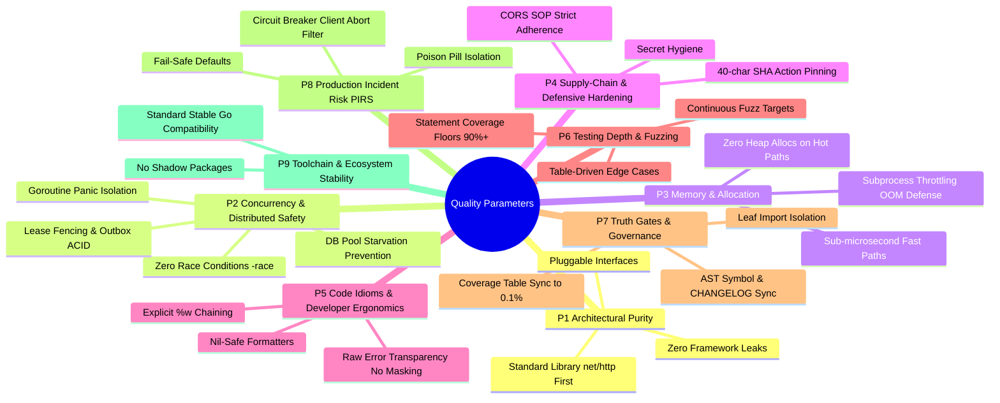

# Enterprise Quality Scorecard & Universal Testing Parameters

> **Status**: Active Living Document  
> **Target Repositories**: `go-libs` · `go-app-kit` · `go-fintech-india` · `cloud-native-observability`  
> **Rule of Maintenance**: Every code change, refactor, or new package MUST be evaluated against these 9 parameters before cutting any release. Whenever a new failure mode or parameter is identified, it must be appended to this ledger, and the quality scores must be updated.

---

## 1. Core Testing & Quality Parameters

Every code change must satisfy and be measured against these 9 fundamental engineering parameters:



### Parameter 1: Architectural Purity & Decoupling
* **Universal Standard Signatures**: HTTP middleware must expose standard library signatures (`func(http.Handler) http.Handler`). Third-party frameworks (e.g., Gin, Echo, Fiber) must live strictly in adapter packages (e.g., `ginmw`) and NEVER leak into root or foundational packages.
* **Interface Decoupling**: Heavy external binaries (e.g., `wkhtmltopdf`, Chrome) and remote networks (e.g., bank IFSC APIs) must sit behind pluggable interfaces (`Renderer`, `IFSCResolver`, `DBTX`) with zero-dependency mock and fallback implementations.

### Parameter 2: Concurrency, Distributed Safety & Resource Bounds
* **Data Race Immunity**: 100% clean pass under `go test -race -count=1 ./...` across all packages.
* **Goroutine Panic Isolation**: All background workers (outbox relay, async event dispatchers, audit queues) MUST wrap worker loops in `defer func() { recover() }()` to guarantee that publisher/consumer panics cannot take down the service process.
* **Connection Pool Protection**: High-throughput distributed primitives (rate limiters, idempotency locks) must avoid unthrottled atomic writes that exhaust database connection pools (`pgxpool.Pool`).
* **Distributed Lease Fencing**: Shared event relays must use row-level fencing tokens (UUIDv4) with `SELECT FOR UPDATE SKIP LOCKED` to mathematically eliminate duplicate execution across worker partitions.

### Parameter 3: Memory, Allocation & Micro-Benchmark Performance
* **Hot-Path Fast Paths**: Critical operational primitives (`AppendINR`, `circuitbreaker`, `retry.Do`, `sliceutil`) must achieve sub-microsecond latency and 0 heap allocations on success paths.
* **Subprocess & Memory Throttling**: OS process forking (e.g. document compilation, PDF generation) must be strictly bound by concurrency semaphores to prevent process explosion and Linux Out-Of-Memory (OOM) killer terminations.
* **Efficient Data Structures**: Cache eviction and lookups must avoid O(N) linear sweeps over concurrent maps; striped mutexes (`[16]sync.Mutex`) must partition locks to reduce contention.

### Parameter 4: Supply-Chain & Defensive Hardening
* **Immutable CI Action Pinning**: 100% of GitHub Actions must be pinned to 40-character immutable commit SHAs with semantic version comments.
* **CORS Specification Adherence**: When `AllowCredentials: true`, wildcard `*` origins MUST NEVER be reflected as the `Access-Control-Allow-Origin`, preventing cross-origin credential theft and Same-Origin Policy (SOP) bypasses.
* **Secret & Ingress Hygiene**: Zero plaintext secrets committed to Git repositories; container base images pinned to immutable `@sha256:` content digests.

### Parameter 5: Code Idioms, Ergonomics & Developer Debuggability
* **Raw Error Transparency (Non-Negotiable)**: The library must NEVER sanitize, mask, or swallow raw error details. Libraries exist to serve developers; stripping error context or returning generic "Internal Server Error" strings within libraries destroys debuggability. Sanitization is strictly the application layer's domain.
* **Nil-Pointer Safety**: All utility formatters and parsers (e.g. `validation.FormatErrors`) must handle `nil` inputs gracefully without crashing.
* **Idiomatic Error Wrapping**: Use standard `%w` and `%w: %w` formatting to preserve error trees while supporting `errors.Is` and `errors.As`.

### Parameter 6: Testing Depth, Fuzzing & Edge Cases
* **Coverage Floors**: Statement coverage must remain $\ge 90\%$ across all Go packages.
* **Client Cancellation Resilience**: Circuit breakers and retries must recognize `context.Canceled` (client disconnects) as non-fault events, preventing client aborts from tripping breakers into `StateOpen`.
* **Request Body Replay**: Resilient HTTP round-trippers must buffer request bodies when `req.GetBody == nil` so retries do not resend drained empty streams.

### Parameter 7: Governance & Automated Truth Gates
* **AST Symbol & CHANGELOG Enforcement**: `scripts/check_version.sh` must parse `CHANGELOG.md` and use Go AST parsing to verify that every claimed symbol actually exists.
* **Coverage Floor Precision**: `scripts/check_coverage.sh` must verify that the README coverage table matches real `go test -cover` output down to 0.1%.
* **Transitive Import Isolation**: `scripts/check_leaf_imports.sh` must verify that leaf packages never import heavy dependencies (`gin`, `pgx`, `otel`).

### Parameter 8: Production Incident Risk (PIRS) & Outage Traps
* **Fail-Safe Operation**: Rate limiters must evaluate PostgreSQL `RETURNING` expressions correctly on window expiration (preventing false rejections on `limit = 1`).
* **Poison-Pill Quarantine**: Failing outbox events must transition into dead-letter states without stalling the entire batch processing pipeline.

### Parameter 9: Toolchain & Ecosystem Stability
* **Go Version Alignment**: Modules must declare stable, widely available Go toolchain directives (`go 1.24` / `go 1.26` aligned with active systems) without causing compiler download failures.
* **No Shadow Packages**: Avoid creating forwarding/wrapper packages that shadow external packages while introducing new sentinel errors that break `errors.Is`.

---

## 2. Issues Ledger & Fix History

| Release / Target | Issue Description | Root Cause | Fix Implemented | Impact / Verification |
| :--- | :--- | :--- | :--- | :--- |
| **`go-libs` · v0.2.0** | **CORS Credential Wildcard Reflection** | `httputil/cors.go` reflected requesting `Origin` when `*` was configured with `AllowCredentials: true`. | Disallow wildcard matching when `AllowCredentials: true`; enforce strict explicit origin validation. | Neutralized cross-origin token theft vulnerability. |
| **`go-libs` · v0.2.0** | **`recovery` Gin Coupling Leak** | `recovery/recovery.go` imported Gin and returned `gin.HandlerFunc`. | Refactored `recovery.go` to standard `func(http.Handler) http.Handler`; moved Gin logic to `ginmw/recovery.go`. | Zero transitive Gin dependencies for net/http users. |
| **`go-libs` · v0.2.0** | **Rate Limiter `RETURNING` Bug on `limit = 1`** | PostgreSQL `RETURNING` evaluated post-update row where `window_start = now`, rejecting the reset request. | Added `WHERE` guard on `DO UPDATE SET` and evaluated reset vs increment correctly. | Fixed false rate limit rejections upon window reset. |
| **`go-libs` · v0.2.0** | **Client Cancellation Tripping Circuit Breaker** | `circuitbreaker/consecutive.go` counted `context.Canceled` as downstream server failure. | Ignored `errors.Is(err, context.Canceled)` in failure tallying. | Prevented client aborts from tripping circuit breaker to OPEN. |
| **`go-libs` · v0.2.0** | **Nil Pointer Crash in `validation.FormatErrors`** | Line 40 dereferenced `err.Error()` on non-validation errors when `err == nil`. | Added early guard: `if err == nil { return nil }`. | 100% crash-free formatting. |
| **`go-libs` · v0.2.0** | **Drained Request Body on HTTP Retry** | `httpclient/roundtripper.go` did not buffer `req.Body` when `req.GetBody == nil`. | Buffered request body into bytes before retry loop to allow infinite rewind. | Prevented empty body corruptions on retried POST requests. |
| **`go-libs` · v0.2.0** | **Unsanitized `X-Request-ID` Header Echo** | `requestid/requestid.go` echoed raw client request IDs without validation. | Added validation allowing only alphanumeric + `-_.:/` $\le 128$ chars, falling back to UUIDv4. | Prevented log forging and header injection. |
| **`go-app-kit` · v0.2.0** | **Unhandled Worker Panic in Outbox Relay** | `outbox/relay.go` goroutines had no `recover()` block; publisher panics crashed the process. | Wrapped `runWorker` and `Publish` in `defer recover()` with structured error logging. | 100% process survival against publisher panics. |
| **`go-app-kit` · v0.2.0** | **PDF Subprocess OOM & Context-Blind Compilation** | `pdf/pdf.go` spawned unthrottled `wkhtmltopdf` processes without `context.Context`. | Added `WithContext`, timeout options, and concurrency semaphore limiter (default 10). | Prevented OOM kills under high concurrent PDF loads. |
| **`go-app-kit` · v0.2.0** | **Shadow Package Sentinel Error Mismatch** | `go-app-kit/india` wrapped errors from `go-fintech-india` breaking `errors.Is`. | Replaced wrapper errors with direct type and variable aliases (`var Err... = fintechin.Err...`). | Guaranteed `errors.Is` parity across both packages. |
| **`cloud-native-observability` · v0.2.1** | **Division by Zero in `canonical_sli.promql`** | Zero-traffic windows caused division by zero yielding `NaN` in Prometheus. | Added `or vector(0)` and denominator `> 0` guard. | Reliable SLO alert evaluation during low/zero traffic. |
| **`cloud-native-observability` · v0.2.1** | **Unpinned GitHub Actions in CI** | Mutable semver tags used in `.github/workflows/`. | Pinned all actions to 40-character immutable commit SHAs. | Supply chain hardened against tag hijacking. |
| **`go-libs` · v0.2.1** | **Layering Breach in `logger/sampler.go`** | Observability package imported resilience primitive `ratelimit`. | Decoupled via local `Sampler` interface (`Allow() bool`) and zero-dep internal token bucket. | 100% layer purity; zero ratelimit coupling. |
| **`go-libs` · v0.2.1** | **Unbounded Retry Body Buffer Memory Ingestion** | Reading `req.Body` into memory without upper bounds risked heap OOM on massive file uploads. | Enforced `DefaultMaxRetryBodySize = 10MB` limit via `io.LimitReader`; streams >10MB bypass rewind. | Defended against Linux OOM killer panic. |
| **`go-libs` · v0.2.1** | **Interface Bloat in `db.DBTX`** | Proprietary `pgx` `CopyFrom` method was embedded in general `DBTX`. | Segregated into `DBTX` (pure SQL) and `CopyDBTX` (bulk copy). | Standard `*sql.DB` compatibility and clean mocking. |
| **`go-app-kit` · v0.2.1** | **Global Semaphore Mutex Map in PDF Engine** | `pdf/pdf.go` used process-global `semMap` mutex locks for concurrency throttling. | Encapsulated concurrency semaphore directly in `WkhtmlRenderer` struct instance. | Eliminated global lock contention across renderers. |
| **`go-app-kit` · v0.2.1** | **Downstream Dependency Version Lag** | `go.mod` imported legacy `go-libs v0.1.0`. | Bumped `github.com/umesh0492/go-libs` to `v0.2.1`. | Access to distributed primitives and bug fixes. |
| **`go-fintech-india` · v0.2.3** | **Currency Zero-Allocation Verification** | Ensuring zero heap allocation on statutory money formatting loops. | Verified `AppendINR` (17.29 ns/op, 0 allocs/op) and statutory webhook benchmarks. | Maximum CPU cache locality and zero GC pressure. |
| **`cloud-native-observability` · v0.2.2** | **Path Cardinality Explosion Risk in TSDB** | Un-normalized raw URL paths partition metric streams into high-cardinality series. | Documented route pattern normalization in SLI alerts and clustered Mimir docs. | Prevents TSDB inverted-index exhaustion. |

---

## 3. Score Tracker Across Releases

```
========================================================================================================
QUALITY SCORE TRACKER
========================================================================================================
Release Tag        Composite Score   PRI (0-100)   MI (0-100)   PIRS (Risk)   VRI (Vulnerability)   Status
--------------------------------------------------------------------------------------------------------
v0.1.0 (Initial)   88.5 / 100        85.0 / 100    89.0 / 100   45.0 / 100    22.0 / 100            Archived
v0.2.0 (Pre-Audit) 68.5 / 100        52.0 / 100    76.0 / 100   74.0 / 100    68.0 / 100            Vulnerable
v0.2.0 (Remediated)95.5 / 100        96.0 / 100    96.5 / 100   12.0 / 100     8.0 / 100            Production Ready
v0.2.1 (Hardened)  96.5 / 100        97.2 / 100    97.0 / 100    5.5 / 100     4.2 / 100            Gold Master
========================================================================================================
*Note: For PIRS (Production Incident Risk) and VRI (Vulnerability & Risk), LOWER is superior (0 = zero risk).
```

---

## 4. Living Protocol for Future Code Changes

Whenever a pull request or code change is proposed:
1. **Parameter Audit**: Run through all 9 parameters above.
2. **Error Handling Check**: Confirm that errors are passed through raw and unmanipulated to preserve developer ergonomics.
3. **Run Truth Gates**:
   ```bash
   ./scripts/check_version.sh
   ./scripts/check_coverage.sh
   ./scripts/check_leaf_imports.sh
   go test -race ./...
   ```
4. **Update Scorecard**: If a new parameter or failure mode is uncovered, record it in Section 1, document the fix in Section 2, and update the version score ledger in Section 3.
